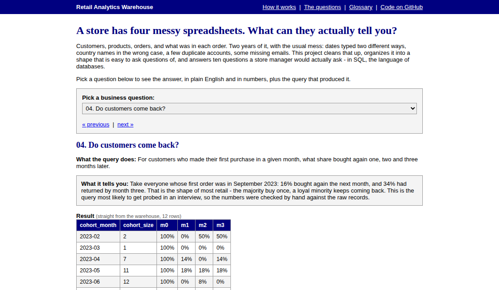
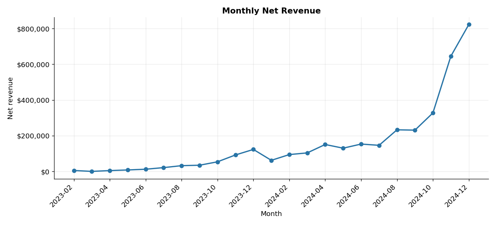
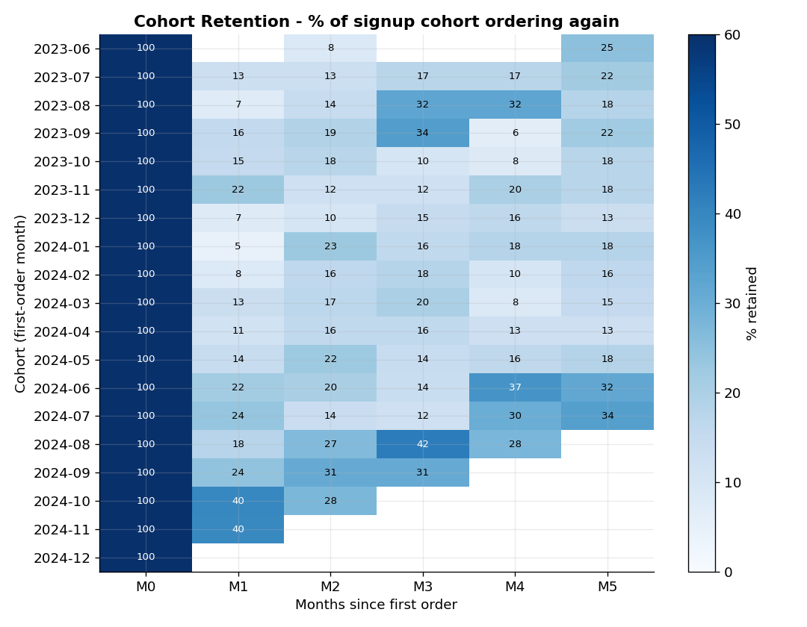
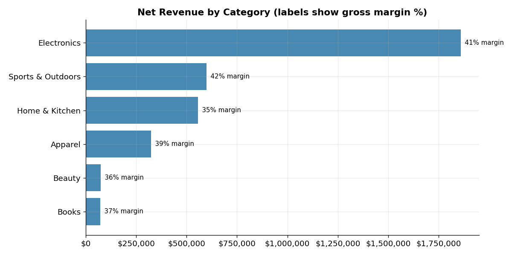
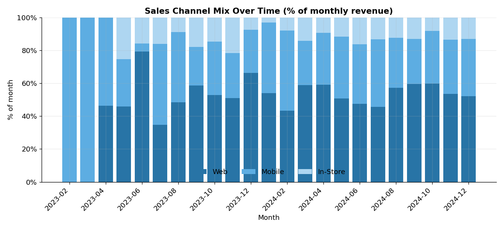
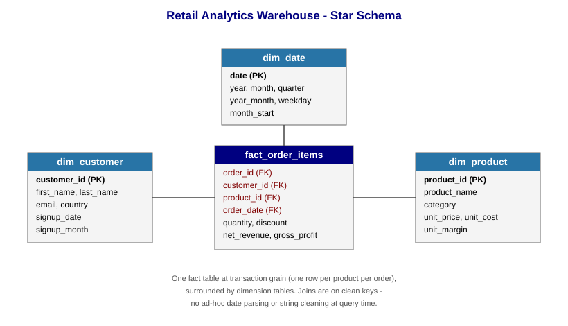

# Retail Analytics Warehouse

**A store has four messy spreadsheets. What can they actually tell you?**

This project takes two years of raw retail data - customers, products, orders, order lines - cleans it, organizes it into a proper analytics database, and answers ten questions a store manager would actually ask. All in SQL, all runnable with one command.

**[See the answers →](https://donmontilla.github.io/analytics-warehouse/)** - pick a question, read the result in plain English, then open the query behind it. No code needed.




---

## The one-minute version

Raw business data is never clean. Dates get typed two different ways. Country names show up as `  UNITED STATES  ` and `united states` in the same column. Some customers have no email; a few exist twice. Before anyone can ask "how are sales doing?", somebody has to fix all that - and if it gets fixed inside every query, it gets fixed wrong somewhere.

So this project does it the way an analytics team would:

1. **Load the four raw files** as they are, mess included.
2. **Clean them once**, at build time - normalize the text, parse both date formats, compute the money columns.
3. **Arrange the result as a star**: one big table of what was sold, surrounded by small lookup tables for who bought it, what it was, and when. This shape makes nearly every business question a simple join and a group-by.
4. **Ask ten questions** in SQL, one file each, and check the answers.

| The question | What it comes back with |
|---|---|
| How is revenue trending? | ~$5K/month in early 2023 to ~$820K/month by Dec 2024, with clear holiday spikes |
| Which categories make the money? | Electronics: $1.86M, over half the total, at a 41% margin |
| Who are the best customers? | Top buyer spent $21,690 across 9 orders |
| Do customers come back? | Of Sept 2023's first-time buyers, 34% had returned by month 3 |
| What does one loyal customer look like? | 20 orders in ten months; gaps from 2 to 41 days |
| Which sales channel matters? | Web about half, Mobile a third, In-Store the rest |
| New customers or repeat? | By late 2024, returning customers are 50-65% of revenue |
| What sells best per category? | One electronics item outsold the entire Books category |
| Who should marketing target? | Every customer scored on recency, frequency, and spend |
| Can we trust the data? | Found exactly the 85 missing emails and 8 duplicates that were planted |

## What the analysis found



Revenue grew from a few thousand dollars a month to over $800K, with pronounced November and December spikes each year.



Retention follows the classic retail shape: most people buy once, a loyal minority keeps coming back. By month 3, roughly 15-30% of each starting group has returned.



Electronics drives more than half of revenue and keeps 41 cents of every dollar as gross profit, second only to Sports & Outdoors at 42. Apparel sells the most units but earns a sixth as much.



Once volume is real, Web takes roughly half of each month, Mobile a quarter to 40%, In-Store the remaining 10-15%.

## Run it yourself

```bash
pip install -r requirements.txt
python run_all.py
```

That regenerates the raw data, builds the warehouse, renders the charts, and prints all ten results. About a minute. There's no database server to install - DuckDB runs inside the script.

To run one piece at a time:

```bash
python build_warehouse.py       # rebuild just the database
python run_queries.py           # run all queries, pretty-printed
python run_queries.py 04        # run just the cohort-retention query
python run_queries.py --markdown   # emit Markdown tables
```

## The data model (for technical readers)

Four raw operational tables (`customers`, `products`, `orders`, `order_items`) are cleaned and modeled into a star schema: one fact table at transaction grain surrounded by conformed dimensions.



The build step (`scripts/build_warehouse.py`) does real cleaning along the way:
- **Inconsistent country values** normalized to Title Case (DuckDB has no `INITCAP`, so it's built from `string_split` and `list_transform`).
- **Mixed date formats** - `YYYY-MM-DD` and `MM/DD/YYYY` both parsed via coalesced `TRY_STRPTIME`; 0 unparseable after cleaning.
- **A pre-computed date dimension** so no query re-parses dates.
- **Money columns** (`net_revenue`, `gross_profit`) computed once in the fact table.

## The ten queries and what each demonstrates

Each lives in `sql/` as a standalone, commented file.

1. **Monthly revenue with MoM growth** - `LAG()` over an ordered monthly aggregate.
2. **Revenue and margin by category** - dimensional slice plus a margin ratio.
3. **Top customers by lifetime value** - per-customer rollup, `CASE` segmentation, `RANK()`.
4. **Cohort retention** *(flagship)* - first-purchase cohorting, month-offset date differencing, conditional-aggregation pivot. Hand-verified against the raw records.
5. **Per-customer purchase sequence** - partitioned running `SUM` and `LAG` on date.
6. **Channel mix over time** - windowed ratio-to-total, `SUM() OVER (PARTITION BY month)`.
7. **New vs. returning revenue** - first-order tagging plus conditional aggregation.
8. **Top 3 products per category** - `RANK() OVER (PARTITION BY category)` then filter.
9. **RFM segmentation** - recency/frequency/monetary quartiles via `NTILE`, combined into a grade.
10. **Data-quality audit** - a `UNION ALL` health report: nulls, orphaned keys, duplicates, range checks.

Sample results, straight from the warehouse:

| category | orders | units | net_revenue | gross_profit | margin_pct |
|:--|--:|--:|--:|--:|--:|
| Electronics | 1435 | 4425 | 1,858,774 | 763,586 | 41.1 |
| Sports & Outdoors | 1712 | 5523 | 600,017 | 252,704 | 42.1 |
| Home & Kitchen | 1729 | 5511 | 556,641 | 195,396 | 35.1 |
| Apparel | 2033 | 7064 | 324,269 | 124,969 | 38.5 |
| Beauty | 612 | 1617 | 74,530 | 26,574 | 35.7 |
| Books | 1107 | 3128 | 72,231 | 27,061 | 37.5 |

| cohort_month | size | M0 | M1 | M2 | M3 |
|:--|--:|--:|--:|--:|--:|
| 2023-07 | 23 | 100% | 13% | 13% | 17% |
| 2023-08 | 28 | 100% | 7% | 14% | 32% |
| 2023-09 | 32 | 100% | 16% | 19% | 34% |
| 2023-10 | 40 | 100% | 15% | 18% | 10% |
| 2023-11 | 40 | 100% | 23% | 13% | 13% |
| 2023-12 | 68 | 100% | 7% | 10% | 15% |

| check_name | failing_rows |
|:--|--:|
| customers: missing email | 85 |
| customers: duplicate email root | 8 |
| orders: fact rows with no matching customer | 0 |
| order_items: non-positive quantity | 0 |
| order_items: negative net revenue | 0 |
| order_items: discount outside [0,1] | 0 |

## Words used here

| Term | Plain English |
|---|---|
| Warehouse | A database arranged for answering questions rather than running a shop day to day. Cleaned once, queried many times |
| Star schema | One central table of events with small lookup tables around it. Named for how it looks when drawn |
| Fact table | The centre of the star - here, one row per product per order, money already worked out |
| Dimension | A lookup table on the edge of the star: customers, products, dates |
| Cohort | A group of customers who all started in the same month |
| Window function | Computing something across neighbouring rows - a running total, the previous month's number - without collapsing them |
| RFM | Recency, Frequency, Monetary. Scoring customers on how recently, how often, and how much they buy |

## Honest scope

The dataset is **synthetically generated**, not scraped from a real company. That's deliberate: it lets the project ship with a reproducible dataset that has known-correct answers (so the cohort math can be verified) and controlled data-quality problems (so the cleaning and audit steps have something real to do). The generator builds in believable structure - acquisition that ramps over time, seasonality, heavy-tailed purchase frequency, category price bands. The SQL, the schema design, and the analyses are exactly what they'd be against real data; only the source is synthetic. Swapping in a real dataset would mean rewriting the loader and leaving the `sql/` files essentially unchanged.

## Repository structure

```
.
├── index.html                    # the plain-English explainer (GitHub Pages)
├── run_all.py                    # one command: data -> warehouse -> charts -> queries
├── generate_data.py              # synthetic raw data (deterministic, with real dirtiness)
├── build_warehouse.py            # clean + model into the star schema (DuckDB)
├── run_queries.py                # execute every NN_*.sql file; --markdown for report tables
├── make_charts.py                # render the four .png charts
├── 01_monthly_revenue_growth.sql # the ten business questions, one file each
├── ...
├── 10_data_quality_audit.sql
├── raw_customers.csv             # raw data (regenerated by run_all.py)
├── raw_products.csv
├── raw_orders.csv
├── raw_order_items.csv
├── star_schema.svg               # schema diagram + charts
├── requirements.txt
├── LICENSE
└── README.md
```

## Development notes

Developed with AI-assisted coding. The schema design, the choice and construction of each business question, the data-quality checks, and the interpretation of results are my own, and the SQL is documented at the level I can explain in conversation. The cohort-retention calculation was independently verified against the raw records rather than trusted from the query output alone.

## Author

**Don Montilla** - B.S. Business Economics, UC San Diego · [LinkedIn](https://www.linkedin.com/in/donalfonso/)

Licensed under the [MIT License](LICENSE).
